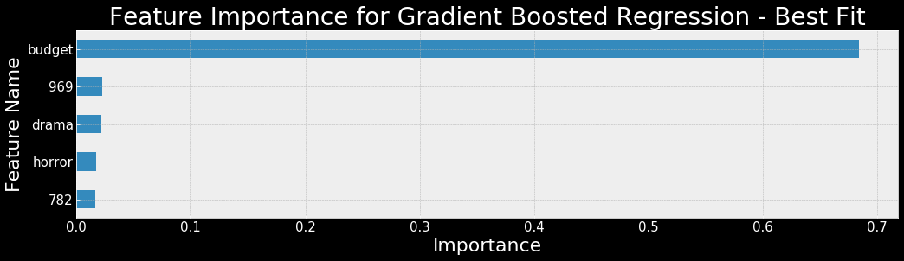
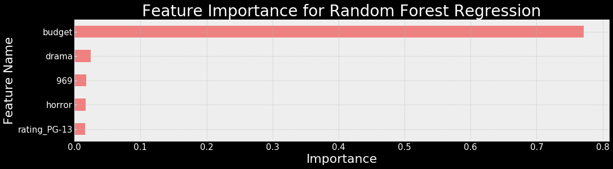
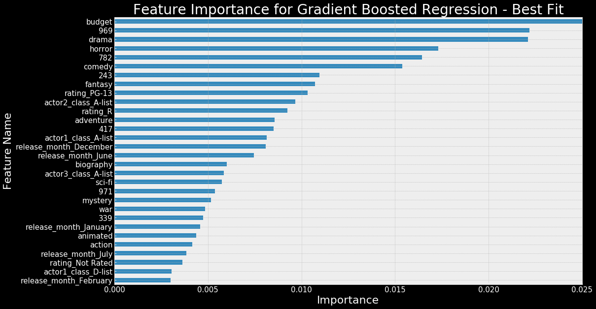
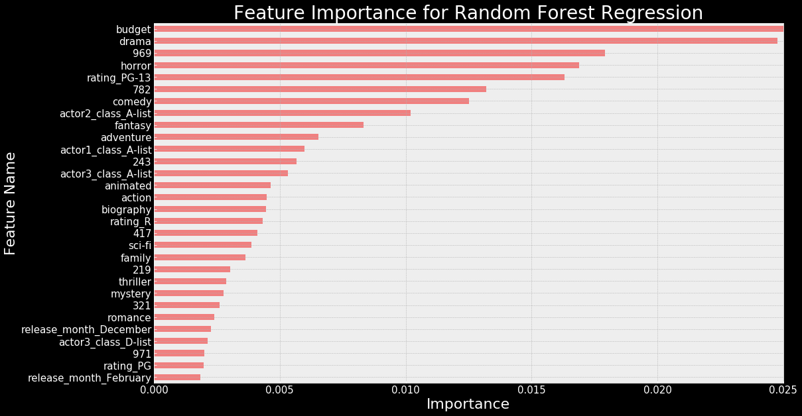
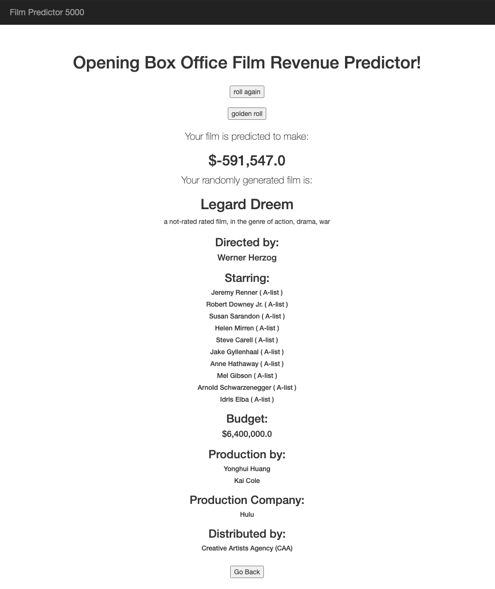

# IMDB Film Reveune Predictor

Predicting opening weekend box office revenue of films based on IMDB data.

__Abstract:__ This project uses the largely categorical data publicly available on IMDB to train machine learning algorithems to predict the box office revenue of fictional or future films.

__Results:__ Using a gradient-boosted trees model the flask application can make live predictions on randomly generated films with ~50% better than baseline accuracy.

All of the film data used was gathered off of the IMDB api and through web scraping of IMDB Pro for the years 2015-2019.

See the presentation slides [Here](https://docs.google.com/presentation/d/1HiHdE-K_BfGqb0XCrnTjhRLFsx-V13X7OpGp2Q2geWo/edit?usp=sharing). See the video [Here]().
 

# Background & Motivation

So many different factors can go into the financial success or failure of a film. More people go to see films with famous actors in them. The size of a films budget is a strong indicator of the investment in marketing. Which company distributes a film can affect how many theatres it releases in. MPAA Rating could limit the audience. The month a film is released determines how many people are off-work or out of school and looking for a film to go see.

It's clear that all of these factors play a role in determining the outcome, but can we train a machine learning algorithem to pick up on these factors and predict the opening box office revenue of films that never existed? What about guessing the box office for films that have yet to release?

For this project I will be using the largely categorical data from IMDB to build this general model that aims to predict the opening box office weekend of any film.

# The Data
#### The basics of film release strategy

 There are certain Hollywood tropes that every young film student learns. Some are more obvious than others, like - "family movies come out around the Holidays" or "documentaries don't make any money" or "action movies release during the summer months". 

It turns out that these are not just meaningless stereotypes about film studio behavior, but they are tried and tested strategies by the film industry to expose their films to the largest and most excited audience that they are able to gather.

  

#### Capturing Star-Power
 Capturing the power of having a big name celebrity in your film is not such a cut and dry case. Even the most popular and hardest working actors in hollywood (Samuel L. Jackson for example) are only in 10 or so movies out of 5 years of data. We are going to need a different strategy to capture the importance of star power in films.

  
  
IMDB keeps a running "Star-Score" on every actor on IMDB. This number is uniquely assigned and decreases as the actor rises in popularity. As such this score has a strong inverse releationship with the high budgets and high revenue films that these Hollywood elite are able to participate in. This will prove to be much more useful information in capturing the impact of a "star".

#### That "other" information at the bottom of the credits

Most people don't read the credits. Once a movie is over they simply grab their belongings and leave the theare. However, lurking in those credits are names that gather more signal for our model. Who was the Executive Producer? What major Studios backed the project? Which companies invested into the distribution of the title?

Most movie-goers don't pay much attention to this information, but we will be looking at just the main Producer, Executive Producer, Director, Production Studio, and Distribution Studio in order to help our model more accurately predict the success of a film.

# Modeling

#### Initial approaches

The average film from our dataset pulls in $6,284,064 on its opening weekend box office. If we repeat this guess for all of the films and calculate our RMSE we get $21,204,973. This will be our baseline on which to improve.

I one-hot encoded for release month, MPAA rating, and the lead actors name. I added this data to the budget information and fit several models. On this simple model Linear Regression was able to perform quite well, but only turned in a $16.1M RMSE which was a mere 24.9% improvement on the baseline. I think we can improve this score further.

There are simply too many actors to take them into account on an individual basis. So, I used the popularity score to categorize actors into "A-list", "B-list", etc, and then I did one hot encoding based on the position on the bill. So lead actor being A-list became its own column etc. With this strategy I was able to improve the linear Regression to $15.7M which brought the score up to a 26% improvement from the baseline.

#### Advanced Approach

There are simply too many Production Companies, Producers, and Executives and the sample size is far too small to have a hope of picking up on their signal individually. Also worth factoring in is the combination of Directors with studios, Actors with Directors, or Actors with one-another. For this reason I selected to convert all of the text features into a string, and perform feature hashing.

  
Looking at the feature importance in our regressors budget remains the strongest feature, but our hashing vector is also consistently finding some important features. 

Looking deeper into feature importance we find:
  

We see a good distribution across our various features, and we're seeing some of the ones we would expect among the most influental features. The model has detected the importance of having A-list actors in a film as well as a symphony of all our other features.

### Results

For my final fit I decided to remove outliers from 2 places: 3% from the top grossing, and 2% each from the highest spent to lost ratio and the lowest money spent to highest returned ratio for a total of ~8% of outliers removed.

This gave me a new baseline RMSE of $8.99M. Fitting our best performing Gradient Boosted Regressor, and performing a grid-search led me to a $4.2M RMSE for a final improvement of 51.6%.

# The App

 
In order to test the models ability to react to unseen or even fictional data I have constructed a flask application. I trained an LSTM neural network to produce random titles, and "Film Predictior 5000" constructs a randomly generated film, gives it a title, and predicts how much revenue the totally fictional film would make on its opening weekend.

I found that users were frustrated at how infrequently they recognized the cast and crew of their randomly generated film. To fix this I created a "Golden Roll" feature that only selects from the top list of actors, directors, companies, and budgets.

The app can be found [here](https://bit.ly/3dNN3US).

 

# Conclusion

This is a messy problem with lots of variables and lots of messy data. We can see how ML techniques can be used to sort through the information to find the signal in the noise, and make some relatively accurate predictions about film revenue based on some pretty basic informtation.

Moving forward the model could be expanded to include more films that were missing from the data-set. There could be more features that could be used to further add to the model. The model could be adapted to different market segments such as straight-to-stream films. However, I think what people enjoy the most is the fictional film generator. People are pretty amused with the AI generated titles and the impossible productions constructed. I had a lot of fun playing with these techniques to generate predictions, but having a fun product for people to play with is where it's at. Enjoy!